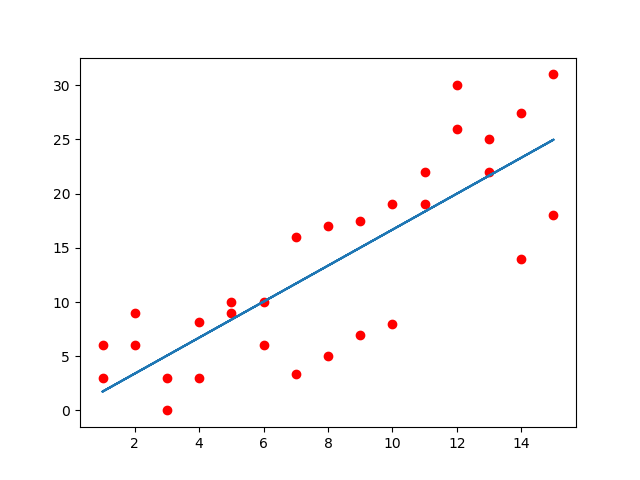

#The Linear Regression algorithm
The objective of the linear regression algorithm is to find a linear function (y = ax + b) that gives results (x, y) as close as possible to the tuples (x, y) of the sample set. The angular coefficient (a) and linear coefficient (b) are calculated by an iterative algorithm called 'gradient descent'.

#The samples file
You must create a text file with all the tuples (x, y) you want to use as a sample. In the file, tuples must be written as sequences of two real values ​​in parentheses, separated by commas, as in the following example: "(-1,3), (4,2), (6,10)". The values ​​of these tuples are, respectively, the x and y values ​​of each sample.
The samples.txt file is an example, you can use it to test the algorithm by typing "samples.txt", "default" or "" (nothing) when the program prompts you for the sample file path.

#The ratio and tolerance values
##Ratio
Ratio is a value by which the derivatives of quadratic errors will be divided to decrement the angular and linear coefficients in gradient descent iterations. You must choose a value greater than or equal to 100 for the ratio. The higher this ratio is, the less likely an error is to occur during the iteration, and the longer the process.

##Tolerance
Tolerance is an error limit accepted by the gradient descent algorithm to find inflection points. As it is usually impossible to iteratively find the inflection point of the MSE (as a function of the angular and linear coefficients of the linear function), it is necessary to delimit a set of points close to the inflection point that, when reached, the gradient descent is taken as complete.
The Tolerance must be a small value. It must be less than 1 and must be asymptotically tended to 0 (also cannot be 0). Values ​​between 0.1 and 0.00001 are recommended.
If the value is too high, linear regression will have an inaccurate result. On the other hand, if the value is too small, a failure may occur during the gradient descent process (which may be corrected by increasing the Ratio).

##Relationship between Ratio and Tolerance
The chosen ratio should be inversely proportional to the chosen tolerance. The lower the tolerance, the higher the ratio.

#Results
Look the following example of running with samples.txt file:

```sh
python main.py
enter the file path where the samples are ("default" or "" for testing): samples.txt
enter the learning ratio (recommended 100): 100
enter the tolerance (recommended 0.01): 0.01
starting iteration...
Regression successfully completed
f(x) = ax + b, where:
a = 1.65980395213
b = 0.0765030679081
```

